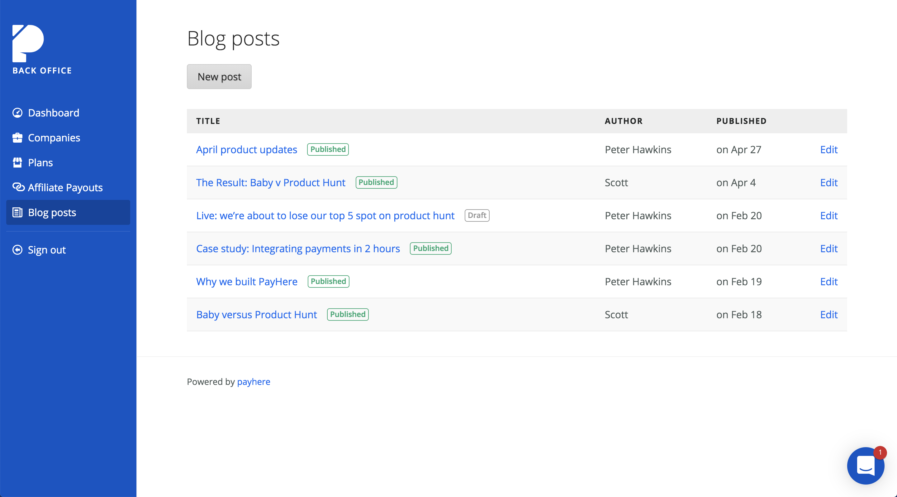

I recently talked about our [Vanilla Rails](http://pooreffort.com/blog/vanilla-rails/) approach that we use in [Alt Labs](http://alternatelabs.co), in short it’s about minimising your dependencies and sticking to the core Rails framework.

This is not a post bashing Active admin, it is a fantastic piece of software and I and many of our clients have gotten great value out of it over the years, I’m extremely grateful to the contributors who made it available.

With that said I believe active admin has it’s place, for the use cases we normally use it in I don’t think we’re choosing the right tool.

## What it’s great at

Active admin is incredible when you need a UI to manage your database. This is great if you’re a developer and know the ramifications of changing values in the database.

## Memory hog

From monitoring several client applications I have found AA to be a big cause of memory bloat over a standard Rails setup. Given the memory issues prevelant in the Ruby language and the painstaking steps I go to, to ensure apps are as fast and scalable as they can be, I don't want to start out at a disadvantage.

## Hard to customise

AA's DSL makes is super simple to change the most common things, but as soon as you want to write bespoke logic it can get messy, fast.

In Rails we have nice controllers that every Rails developer is familiar with, if we want to write an admin endpoint to cancel a subscription it would look something like this:

```ruby
module Admin
  class Subscriptions
    def cancel
      subscription = Subscription.find(params[:id])
      subscriptions_manager = SubscriptionsManager.new(subscription)
      subscriptions_manager.cancel

      redirect_to admin_subscription_path(subscription), notice: "Subscription cancelled"
    end
  end
end
```

Of course we can do all the normal controller refactorings to make this more DRY

```ruby
module Admin
  class Subscriptions
    def cancel
      subscriptions_manager.cancel
      redirect_to admin_subscription_path(subscription), notice: "Subscription cancelled"
    end

    private

    def subscription
      @subscription ||= Subscription.find(params[:id])
    end

    def subscriptions_manager
      @subscriptions_manager ||= SubscriptionsManager.new(subscription)
    end
  end
end
```

Now how does this work in active admin? Well first of all I have to read through the other AA files to get an example of this each time because it’s a Quirky DSL and not just plain Ruby.

```ruby
member_action :cancel_subscription, method: [:post] do
  subscriptions_manager = SubscriptionsManager.new(resource)
  subscriptions_manager.cancel

  redirect_to admin_subscription_path(resource)
end
```

To me this DSL is a big problem, it doesn't allow me to make use of the same refactoring techniques that I would normally use and it just adds complexity.

## User Experience

Building an admin from scratch also affords you complete control over the UX, allowing you to keep your admin simple and only expose the functionality required. As an example checkout the Payhere back office we use to manage Payhere customers, blogs and affiliate payouts.



## Conclusion

Whilst Active Admin provides a lot of functionality out of the gate, in the long run it tends to shoehorn admin functionality into it's own style and prevents me from being able to provide a best-in-class admin interface for my own products and clients.

I much prefer to start from scratch and build admin panels the Rails way–even if that takes a little longer at first.
