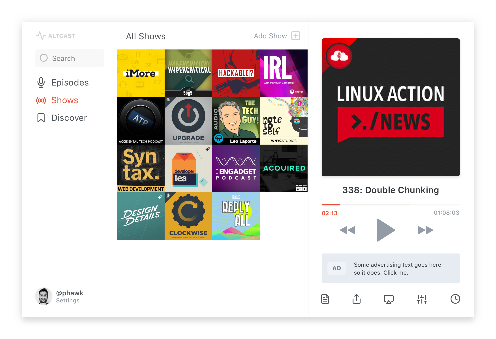

There are many great podcast players out there for iOS, I have been an avid [Overcast](https://overcast.fm) user for years. So, why have I decided to make my own podcast app? I listen to podcasts from many different places, the car, the kitchen, out on walks with the dog, and while sitting at my desk on my mac. However, there isn't a great podcast experience on mac right now and many people seem to be crying out for one.

Asides from a perceived need, I love to build products and building things for myself is enjoyable, helps me as a developer to polish my skills, and gives me a chance to play with shiny new technologies.

### Altcast

On talking with Scott, my business partner who runs [Alt Labs](https://alternatelabs.co/) with me, he came up with the name Altcast, which I immediately liked and snapped up the altcast.fm domain (I haven't put a landing page together just yet).

### How will Altcast be any different?

I truly love minimal and simple software, doing one thing well, so that will be a leading waypoint when designing the UX of the app.

Alongside simplicity, I want to provide a great experience on all major platforms enabling sync between them. Plans are to support iOS, Android, web, and macOS. For the MVP this may mean launching to only one or a small subset of these platforms.

### How can one developer build a side project on all of these platforms?

This is certainly a concern, I know how hard it is to launch and test an app and we are always advising clients on picking one platform to launch on initially.

Altcast is built using React Native – for me, this is the only productive way to develop mobile applications nowadays and with [expo](https://expo.io/), the process is only getting better.

One of the latest editions in expo is [React Native Web](https://github.com/necolas/react-native-web) support, this allows using the exact same code as React Native but targeted for web.

With RN and RNW I can use the same codebase and tooling to build for all these platforms. Without a unified codebase, there would be no way of launching on all platforms mentioned above without major funding and more developers.

As a side note: when macOS Catalyst ships, it's likely React Native will be able to build truly native macOS apps.

## Early access

I want to build in the open as much as possible, I have a barely functional prototype which I am now using myself, but I would be very keen to have other testers on board to help me build something awesome.

I don't want anybody vaguely interested signing up and then never using the product, so I have decided to run a paid early access program to make sure early testers are invested and give the best feedback possible.

if you want to be a part of building a great desktop podcast player you can sign up for the early access program below and get access to Altcast as soon as it's ready for £5.99. You will get access to the app throughout the private period and 6 months of access when it launches.

[Join the early access program](https://app.payhere.co/phawk/altcast-early-access)

Payments are taken using our other product Payhere – [find out more about it](https://payhere.co/blog/why-we-built-payhere).

---

If you want to keep up to date on Altcast and any of my other products [subscribe to my mailing list](http://eepurl.com/c5xsXb).
